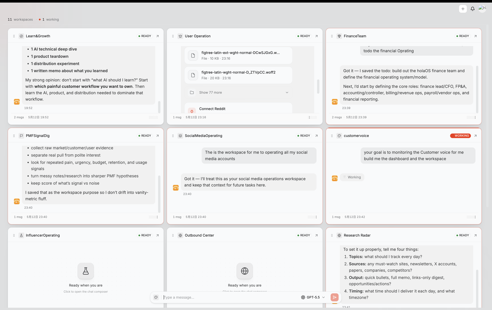
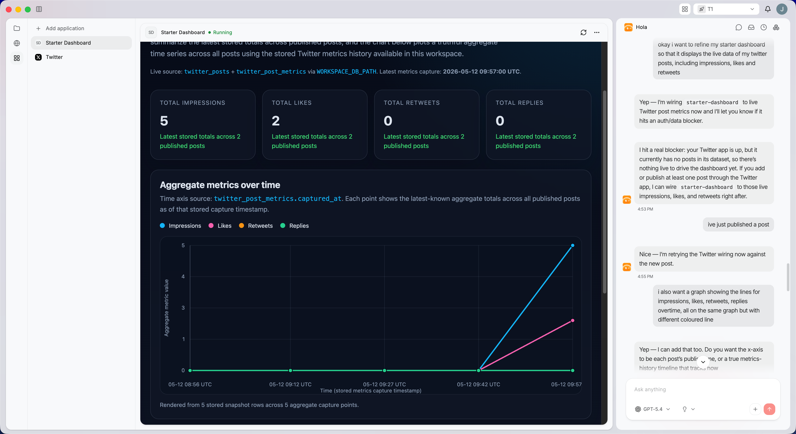

<p align="center">
  
</p>

<p align="center"><strong>Turn repeat work into running AI work-streams.</strong></p>

<p align="center">
  <a href="https://github.com/holaboss-ai/holaOS/actions/workflows/ci.yml"></a>
  
  
  
  
  
</p>

<p align="center">
  <a href="https://x.com/Holabossai"></a>
  <a href="https://discord.com/invite/NSeHUCBj6"></a>
</p>

<p align="center"><strong>⭐ Help us reach more developers and grow the holaOS community. Star this repo!</strong></p>

<p align="center">
  <a href="https://www.holaos.ai/?utm_source=github&utm_medium=oss&utm_campaign=hola_boss_oss&utm_content=readme_nav_website">Website</a> ·
  <a href="https://www.holaos.ai/docs/getting-started?utm_source=github&utm_medium=oss&utm_campaign=hola_boss_oss&utm_content=readme_nav_docs">Docs</a> ·
  <a href="https://www.holaos.ai/signin?utm_source=github&utm_medium=oss&utm_campaign=hola_boss_oss&utm_content=readme_nav_signin">Sign in</a> ·
  <a href="#quick-start">Quick Start</a>
</p>

# holaOS

<p align="center">
  
</p>

holaOS turns recurring, context-heavy work into running AI work-streams.

Create a workspace for the work you keep restarting in chat — weekly research, content production, customer feedback, launch planning, or client delivery. Kickoff turns that work into goals, context, rules, sources, a first artifact, and the next run. When you review the output and correct it, those corrections become visible rules so the next run starts smarter than the last.

Under the hood, holaOS is an open agent computer: a shared environment where agents can use the same browser, files, apps, tools, and runtime state you do. The difference in Beta 0.1 is the product loop. Instead of giving an agent one disposable session, you give each recurring work-stream a living workspace with its own memory, history, outputs, and control surface.

Use it for work that unfolds over time: research that changes every week, content that needs your voice, feedback that should become product decisions, launches with many moving parts, and client work that needs isolated context. The first win is not configuring a blank agent. The first win is seeing a workspace created from a real recurring job, with a reviewable output and a next run already set up.

**What changed in Beta 0.1**

- **Multi Workspaces** keep each long-running work-stream in its own context, rules, tools, files, history, and next run.
- **Sub Agents** help complex work move forward in parallel — research, drafting, verification, synthesis — without manually juggling chats.
- **Dashboards** for active visualization that you and your agent maintain


<p align="center">
  
</p>
<p align="center">
  <em>Inside the workspace: apps, files, a completely customizable dashboard, and agent chat live side by side while a single user-facing agent manager coordinates sub agents in the background.</em>
</p>


## Examples

Try holaOS with one recurring job you keep restarting:

- **Research Radar** — track competitors, market shifts, funding news, and customer signals; ship a weekly brief with sources and deltas.
- **Content Engine** — turn founder notes into X posts, newsletter drafts, and video hooks while saving edits as style rules.
- **Customer Voice** — group feedback from calls, support, Discord, and X into a product action board.
- **Launch / Campaign Workstream** — generate a campaign calendar, channel briefs, asset gaps, daily metrics, and retrospective.
- **Client Delivery Loop** — create an isolated workspace for each client while reusing your delivery playbook.


## Table of Contents

- [Quick Start](#quick-start)
    - [What you need](#what-you-need)
    - [One-Line Install](#one-line-install)
- [Documentation](#documentation)
- [Manual Install](#manual-install)
    - [One-Line Agent Setup](#one-line-agent-setup)
- [Contributing](#contributing)
- [OSS Release Notes](#oss-release-notes)

## Quick Start

### One-Line Install

For a fresh-machine bootstrap on macOS, Linux, or WSL, use the repository installer:

```bash
curl -fsSL https://raw.githubusercontent.com/holaboss-ai/holaOS/refs/heads/main/scripts/install.sh | bash -s -- --launch
```

You can also follow the manual path if you want to control each setup step.

## Star the Repository

<p align="center">
  
</p>

<p align="center"><strong>If holaOS is useful or interesting, a GitHub Star would be greatly appreciated.</strong></p>

## Documentation

All deeper technical and product documentation lives at **[holaos.ai/docs](https://www.holaos.ai/docs)**:

| Section | What's Covered |
| --- | --- |
| [Overview](https://www.holaos.ai/docs/getting-started) | The merged entry page for the environment-engineering thesis and system model |
| [Quick Start](https://www.holaos.ai/docs/getting-started/quick-start) | The fastest path to a working local desktop environment |
| [Workspaces](https://www.holaos.ai/docs/getting-started/workspaces) | How workspaces are created, switched, managed, and represented on disk |
| [Environment Engineering](https://www.holaos.ai/docs/concepts/environment-engineering) | The core thesis behind holaOS and why the environment defines the system |
| [Concepts](https://www.holaos.ai/docs/concepts/concepts) | Core system vocabulary for workspaces, runtime, memory, and outputs |
| [Workspace Model](https://www.holaos.ai/docs/concepts/workspace-model) | Workspace contract, authored surfaces, and runtime-owned state |
| [Memory and Continuity](https://www.holaos.ai/docs/concepts/memory-and-continuity) | Durable memory, continuity artifacts, and long-horizon resume behavior |
| [Agent Harness](https://www.holaos.ai/docs/concepts/agent-harness) | The stable harness boundary inside the runtime and how executors fit into it |
| [Independent Deploy](https://www.holaos.ai/docs/contribute/runtime/independent-deploy) | Running the portable runtime without the desktop app |
| [Build on holaOS](https://www.holaos.ai/docs/contribute) | The code-true developer map for desktop, runtime, apps, templates, and validation paths |
| [Start Developing](https://www.holaos.ai/docs/contribute/start-developing) | The local developer path for desktop and runtime validation |
| [Runtime APIs](https://www.holaos.ai/docs/contribute/runtime/apis) | The runtime operational surface for workspaces, runs, streaming, and app lifecycle |
| [Build Your First App](https://www.holaos.ai/docs/build/apps/first-app) | Building workspace apps on top of holaOS |
| [Reference](https://www.holaos.ai/docs/reference/environment-variables) | Environment variables and supporting reference material |


## Manual Install

You likely will not need this section because One-Line Install runs the same setup. Use Manual Install when you want to inspect or control each step. If you use the manual path, verify the usual prerequisites first:

```bash
git --version
node --version
npm --version
```

### One-Line Agent Setup

If you use Codex, Claude Code, Cursor, Windsurf, or another coding agent, you can hand it the setup instructions in one sentence:

```text
Run the holaOS install script from https://raw.githubusercontent.com/holaboss-ai/holaOS/refs/heads/main/scripts/install.sh. It should install git and Node.js 24.14.1/npm if they are missing, clone or update the repo into ~/holaboss-ai unless I specify another --dir, run desktop:install, create desktop/.env from desktop/.env.example if needed, run desktop:prepare-runtime:local and desktop:typecheck, and only run desktop:dev if I ask for --launch. If Electron cannot open, stop after verification and tell me the next manual step.
```

That handoff keeps the installation flow self-contained while leaving the detailed bootstrap steps in the repo-local [INSTALL.md](INSTALL.md) runbook.

This is the baseline installation flow for local desktop development.

1. Install the desktop dependencies from the repository root:

```bash
npm run desktop:install
```

2. Create your local environment file:

```bash
cp desktop/.env.example desktop/.env
```

If you are following the repo exactly, keep the file close to the template and only change the values that your provider or machine needs.

3. Prepare the local runtime bundle:

```bash
npm run desktop:prepare-runtime:local
```

4. If you want a quick validation pass before launching Electron, run:

```bash
npm run desktop:typecheck
```

5. Start the desktop app in development mode:

```bash
npm run desktop:dev
```

The `predev` hook will validate the environment, rebuild native modules, and make sure a staged runtime bundle exists.

If you want to stage the runtime before opening the desktop app, there are two common paths:

Build from local runtime:

```bash
npm run desktop:prepare-runtime:local
```

Fetch the latest published runtime:

```bash
npm run desktop:prepare-runtime
```

Use the local path when you are actively changing runtime code. Use the published bundle when you want to verify the desktop against a known release artifact.

Use `One-Line Install` when you want the fastest path to a working local desktop environment. Use `Manual Install` when you need to inspect or control each setup step yourself.

## Contributing

If you want to contribute, start with [Start Developing](https://www.holaos.ai/docs/contribute/start-developing) to get the local desktop and runtime loop working, then use [Contributing](https://www.holaos.ai/docs/contribute/start-developing/contributing) for validation, commit, and review expectations.

## OSS Release Notes

- License: modified Apache 2.0 with additional commercial-distribution and branding conditions. See [LICENSE](LICENSE).
- Security issues: report privately to `admin@holaboss.ai`. See [SECURITY.md](SECURITY.md).
